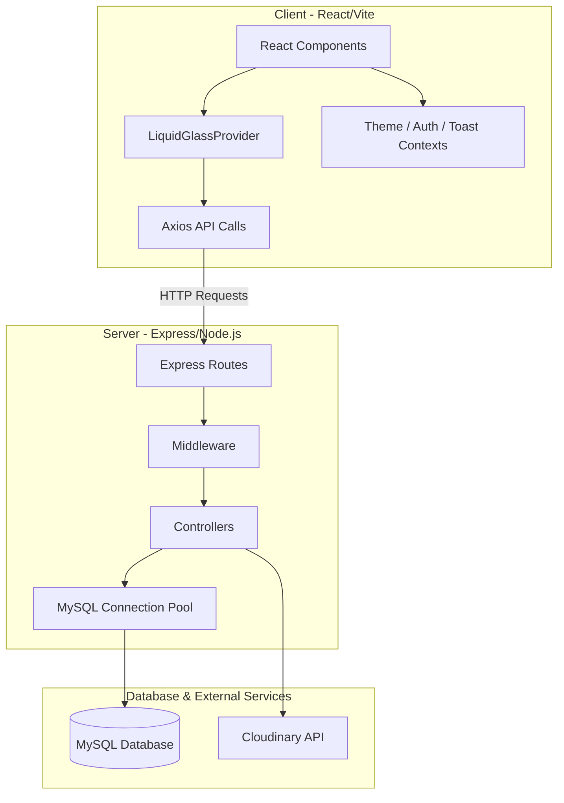
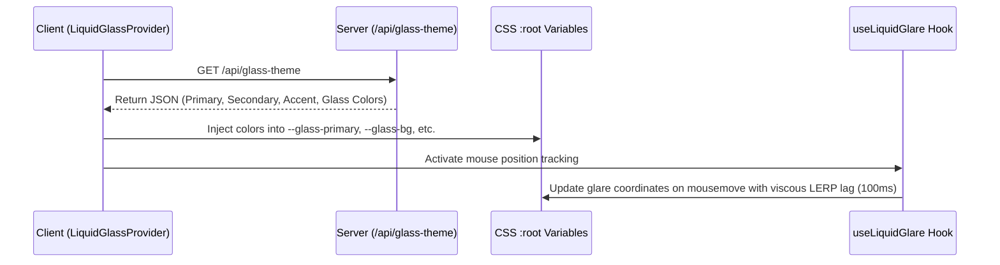

# 🏛️ InnerVoice Architecture

Welcome to the **InnerVoice** architecture documentation. This document details the system design, directory structures, database models, state management, and the unique glassmorphic theme mechanics of the application.

---

## 📌 High-Level Architecture

InnerVoice is built using a modern decoupled client-server architecture:
- **Backend (Express, Node.js, MySQL)**: A RESTful API that handles authentication, notes CRUD operations, profile management, and dashboard analytics.
- **Frontend (React, Vite, Tailwind CSS v4)**: A highly interactive, responsive single-page application (SPA) featuring smooth animations and custom iridescent glassmorphism themes.



---

## 📁 Project Directory Structure

```
InnerVoice/
├── client/                     # Frontend Application (React + Vite)
│   ├── src/
│   │   ├── api/                # Axios instances & API request modules
│   │   ├── assets/             # Images, styles, static files
│   │   ├── components/         # Reusable UI elements (buttons, layout, cards)
│   │   ├── context/            # React Contexts (Auth, Toast, LiquidGlass, Theme)
│   │   ├── hooks/              # Custom hooks (useAuth, useNotes, useLiquidGlare)
│   │   ├── pages/              # Routed pages (Dashboard, Admin, Profile, Login, etc.)
│   │   ├── routes/             # App routing logic
│   │   ├── App.jsx             # App entry/setup
│   │   ├── main.jsx            # DOM mounting
│   │   └── index.css           # Global CSS variables & Tailwind directives
│   └── package.json
│
├── server/                     # Backend Application (Node.js + Express)
│   ├── config/                 # DB connections, CDN configurations
│   ├── controllers/            # Request handlers (auth, notes, admin, profile)
│   ├── middleware/             # Express middlewares (auth, upload, logging, errors)
│   ├── models/                 # Leftover/stub Mongoose models (Note, User, Mood)
│   ├── routes/                 # Express endpoint routes
│   ├── utils/                  # Cryptography & Validation helpers
│   ├── server.js               # Express application setup
│   └── package.json
│
└── README.md
```

---

## 💾 Database Architecture

The application uses **MySQL** as its primary database. Database connections are managed via a connection pool using the `mysql2/promise` library.

### Leftover MongoDB Reference
> [!IMPORTANT]
> Files located inside `server/models` (e.g., `User.js`, `Note.js`, `Mood.js`) use the `mongoose` library for MongoDB. These are legacy/stub files and are **not** currently used in the active SQL-based controller database queries.

### Relational Schema (MySQL)
The controllers interact directly with the following MySQL tables via SQL queries:

#### 1. `users` Table
Stores user account details and credentials.
- `id` (INT, Primary Key, Auto-increment)
- `full_name` (VARCHAR)
- `email` (VARCHAR, Unique)
- `password` (VARCHAR, hashed with bcrypt)
- `vault_pin` (VARCHAR, hashed, optional) - Pin used for private notes vault.
- `role` (VARCHAR) - Defines user authorization level (e.g. `'admin'`, `'user'`).
- `created_at` (TIMESTAMP)

#### 2. `notes` Table
Stores journal entries and notes metadata.
- `id` (INT, Primary Key, Auto-increment)
- `user_id` (INT, Foreign Key referencing `users(id)`)
- `title` (VARCHAR)
- `content` (TEXT)
- `category` (VARCHAR, default `'General'`)
- `feeling` (VARCHAR, default `'Neutral'`)
- `is_locked` (TINYINT/BOOLEAN) - Protects the note with vault PIN.
- `created_at` (TIMESTAMP)
- `updated_at` (TIMESTAMP)

---

## 🎨 Liquid Glass & Iridescent Theme Engine

One of InnerVoice's standout features is its **Liquid Glass Theme**, which implements highly styled glassmorphic elements and mouse-tracking glare effects.

### Mechanics



1. **Server Theme Config (`/api/glass-theme`)**:
   The backend defines an API endpoint inside `server.js` returning CSS configurations for Light and Dark iridescent glassmorphic palettes:
   - Primary, Secondary, Accent colors.
   - Glass Background, Glass Border, and Glass Inset values.
2. **Injecting Styles (`LiquidGlassProvider`)**:
   The `LiquidGlassProvider` context fetches these specs and injects them onto the `<html>` document `:root` element as CSS variables.
3. **Viscous Mouse Glare (`useLiquidGlare`)**:
   Tracks the user's cursor position, applying a **Linear Interpolation (LERP)** algorithm at `0.06` factor to animate the glare circle with a 100ms lag. This gives the overlay the feel of a thick, premium glass refraction.

---

## 🔒 Security & Middleware Pipeline

1. **Authentication**: JWT tokens are signed on login/signup, passed as authorization headers, and validated via the `authMiddleware.js`.
2. **Password Hashing**: Done using `bcryptjs` for both login validation and user registration.
3. **Vault PIN Hashing**: Hashed credentials protect individual notes marked with `is_locked = 1`.
4. **Middlewares**:
   - `liquidLogger.js`: Custom middleware coloring standard logging outputs using `chalk`.
   - `errorMiddleware.js`: Catch-all handlers for JSON syntax parsing failures, 404 routes, and global Server Errors.
   - `upload.js`: Configured `multer` instance interacting with `cloudinary` and `streamifier` for buffer uploads.

---

## 🛠️ Key Files Reference

- [server.js](file:///c:/Users/ajeet/Desktop/Proj1/InnerVoice/server/server.js) — Backend setup and theme API.
- [db.js](file:///c:/Users/ajeet/Desktop/Proj1/InnerVoice/server/config/db.js) — MySQL pool connection manager.
- [App.jsx](file:///c:/Users/ajeet/Desktop/Proj1/InnerVoice/client/src/App.jsx) — Frontend routers and providers layout.
- [LiquidGlassProvider.jsx](file:///c:/Users/ajeet/Desktop/Proj1/InnerVoice/client/src/context/LiquidGlassProvider.jsx) — Theme injection controller.
- [useLiquidGlare.js](file:///c:/Users/ajeet/Desktop/Proj1/InnerVoice/client/src/hooks/useLiquidGlare.js) — Lerping cursor tracker logic.
- [noteController.js](file:///c:/Users/ajeet/Desktop/Proj1/InnerVoice/server/controllers/noteController.js) — Note database transactions.
