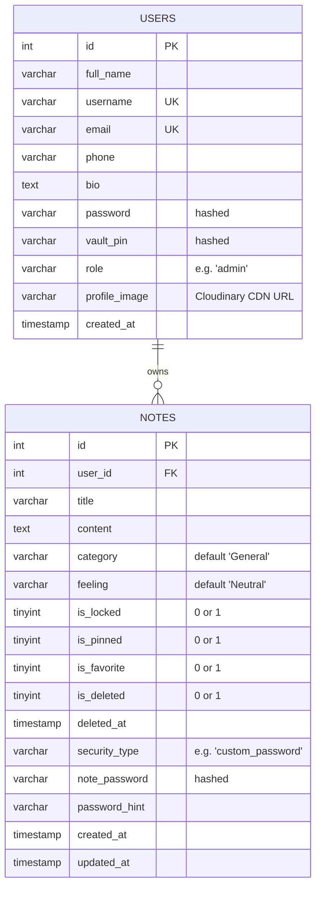

# 💾 InnerVoice Database Documentation

This document describes the database layer of **InnerVoice**, detailing the MySQL relational schemas, connection pool configuration, core transactions, and legacy stubs.

---

## 🔌 Connection & Pool Setup

InnerVoice connects to a **MySQL** server. The connection is configured as a promise-based connection pool using `mysql2/promise` located in [db.js](file:///c:/Users/ajeet/Desktop/Proj1/InnerVoice/server/config/db.js).

### Configuration Parameters
The connection reads credentials from the backend environment file (`.env`):
- `DB_HOST`: Database server host address.
- `DB_USER`: Database username.
- `DB_PASSWORD`: Database password.
- `DB_NAME`: Target database name.
- `DB_PORT`: Port (typically `3306`).

### Pool Settings
- `waitForConnections: true`: Request queries are queued if no connection is immediately available.
- `connectionLimit: 10`: Limits concurrent connections to a maximum of 10.
- `dateStrings: true`: Forces MySQL to return dates as strings instead of JavaScript Date objects, avoiding local timezone offsets.

---

## 🗄️ Database Schemas

The application operates on two main tables: `users` and `notes`. 

### 1. `users` Table
Stores authentication details, credentials, profile settings, and vault security configurations.

| Column | Type | Constraints | Description |
| :--- | :--- | :--- | :--- |
| `id` | `INT` | Primary Key, Auto-increment | Unique identifier for each user |
| `full_name` | `VARCHAR` | NOT NULL | User's full display name |
| `username` | `VARCHAR` | Unique, Nullable | Custom username handle |
| `email` | `VARCHAR` | Unique, NOT NULL | Registration email address (used for login) |
| `phone` | `VARCHAR` | Nullable | User's contact number |
| `bio` | `TEXT` | Nullable | Mini-biography |
| `password` | `VARCHAR` | NOT NULL | Bcrypt hash of the user login password |
| `vault_pin` | `VARCHAR` | Nullable | Hashed 4-digit PIN for general notes vault |
| `role` | `VARCHAR` | Default: `'user'` | Access control levels (`'admin'` or `'user'`) |
| `profile_image` | `VARCHAR` | Nullable | URL to stored Cloudinary profile avatar |
| `created_at` | `TIMESTAMP` | Default: `CURRENT_TIMESTAMP` | Account creation date |

---

### 2. `notes` Table
Stores the user's journal entries, categories, emotional tags, and security descriptors.

| Column | Type | Constraints | Description |
| :--- | :--- | :--- | :--- |
| `id` | `INT` | Primary Key, Auto-increment | Unique identifier for each note entry |
| `user_id` | `INT` | Foreign Key (references `users.id`) | Links the entry to a specific user account |
| `title` | `VARCHAR` | NOT NULL | Title of the note |
| `content` | `TEXT` | NOT NULL | Text body content |
| `category` | `VARCHAR` | Default: `'General'` | User-defined category label |
| `feeling` | `VARCHAR` | Default: `'Neutral'` | Emotion/feeling tag linked to the entry |
| `is_locked` | `TINYINT` / `BOOLEAN` | Default: `0` | Flag determining if access requires PIN/Password verification |
| `is_pinned` | `TINYINT` / `BOOLEAN` | Default: `0` | Pin note to the top of the dashboard feed |
| `is_favorite` | `TINYINT` / `BOOLEAN` | Default: `0` | Favorite flag for quick filtering |
| `is_deleted` | `TINYINT` / `BOOLEAN` | Default: `0` | Soft delete flag (moved to Trash) |
| `deleted_at` | `TIMESTAMP` | Nullable | Timestamp recorded when note is moved to trash |
| `security_type` | `VARCHAR` | Nullable | Set to `'custom_password'` if protected by a specific note password |
| `note_password` | `VARCHAR` | Nullable | Bcrypt hash of note-specific password (if custom) |
| `password_hint` | `VARCHAR` | Nullable | Optional hint to recover custom note password |
| `created_at` | `TIMESTAMP` | Default: `CURRENT_TIMESTAMP` | Entry creation timestamp |
| `updated_at` | `TIMESTAMP` | Default: `CURRENT_TIMESTAMP` | Last updated timestamp |

---

## 🔒 Security Data Flows

### General Vault Locking
When a note has `is_locked = 1` and `security_type` is `NULL`, it is protected by the user's global vault PIN:
1. Server checks if the user has a configured `vault_pin` on the `users` record.
2. Unlocking requires matching the input PIN against the hashed `users.vault_pin` value.

### Note-Specific Passwords
When a note has `is_locked = 1` and `security_type = 'custom_password'`:
1. The note record stores its own hashed password in `notes.note_password`.
2. Unlocking matches the input against `notes.note_password` rather than the user's vault PIN.

### Password Recovery Flow
If the custom note password or vault PIN is forgotten:
1. The reset recovery flow compares user input against the main account login hash (`users.password`).
2. Upon successful validation of the account password, a new note password or PIN can be safely hashed and saved.

---

## ⚠️ Legacy MongoDB Stubs Warning

> [!WARNING]
> The directory `server/models` contains mongoose-based model files:
> - `User.js`
> - `Note.js`
> - `Mood.js`
> 
> These files are legacy artifacts from a previous MongoDB implementation and are **completely unused**. Changing these files will not affect database functionality; all current controllers query the **MySQL connection pool** directly using raw SQL commands.
