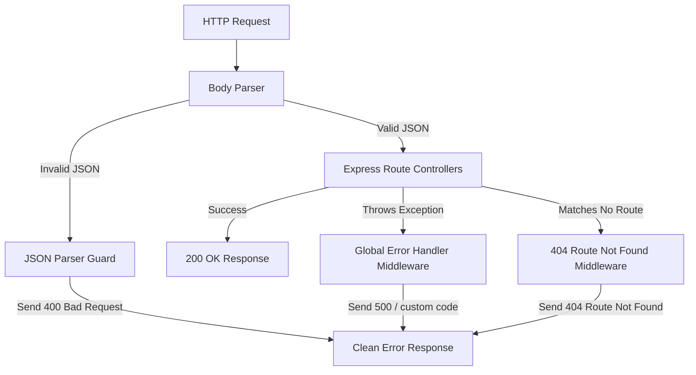

# 🛠️ InnerVoice Error Handling Architecture

This document describes the design patterns, middleware pipelines, and boundary wrappers implemented across **InnerVoice** to handle backend crashes, JSON body parsing, and frontend UI recovery state.

---

## ⚙️ Backend (Server-Side) Pipeline

The Express server handles errors through a sequential middleware chain registered in [server.js](file:///c:/Users/ajeet/Desktop/Proj1/InnerVoice/server/server.js).



---

### 1. Request Body Guard (Invalid JSON)
By default, Express body-parsers throw an HTML error page if incoming JSON is malformed. To prevent server exposures and client JSON-parsing exceptions:
```javascript
// Registered inside server.js
app.use((err, req, res, next) => {
  if (err.type === "entity.parse.failed") {
    return res.status(400).json({
      success: false,
      message: "Invalid JSON in request body. Please send valid JSON.",
    });
  }
  next(err);
});
```

---

### 2. Route Not Found (404 Handler)
Requests that do not match any defined endpoint are caught by a custom fallback middleware located in [errorMiddleware.js](file:///c:/Users/ajeet/Desktop/Proj1/InnerVoice/server/middleware/errorMiddleware.js):
```javascript
export function notFound(req, res, _next) {
  res.status(404).json({ message: `Route not found: ${req.originalUrl}` });
}
```

---

### 3. Global Exception Catcher (500 Handler)
Any unhandled exceptions thrown during request execution are routed to the central exception handler, preventing thread blocks:
```javascript
export function errorHandler(err, _req, res, _next) {
  const statusCode = res.statusCode && res.statusCode !== 200 ? res.statusCode : 500;
  res.status(statusCode).json({
    message: err.message || "Internal server error"
  });
}
```

---

### 4. Controller Transaction Guards
Database queries in controller routes are wrapped inside `try/catch` blocks.
- **SQL Exceptions**: Database errors (e.g. duplicate username, syntax errors) are safely logged via `console.error` and returned to the client as clean JSON responses (`success: false`).
- **File System Debug Logging**: Note controllers write detailed execution trails to `server/debug.log` using standard `fs.appendFileSync` blocks to simplify diagnostics.

---

## 💻 Frontend (Client-Side) Pipeline

---

### 1. Application-Level Error Boundary
React lifecycle crashes (e.g., render-time null reference bugs) are isolated by the [ErrorBoundary.jsx](file:///c:/Users/ajeet/Desktop/Proj1/InnerVoice/client/src/components/ErrorBoundary.jsx) wrapper enclosing the page layouts:
- **Crash Interception**: Utilizes React lifecycle hook `getDerivedStateFromError` to intercept and set component error states.
- **Diagnostics**: Logs stack traces via `componentDidCatch` to developer logs.
- **Fallback UI**: Renders an alert panel featuring a clean layout and a reload button allowing the user to refresh the DOM context without leaving the app.

---

### 2. Network Response Catching
All API queries use a global Axios instance (`client/src/api/axios.js`).
- Individual component calls enclose dispatch actions inside `try/catch` blocks.
- The rejected promise payloads extract response messages (e.g. `error.response?.data?.message || "Something went wrong"`) and forward them directly to the `ToastContext` toast scheduler to alert users via micro-interaction toast banners.

---

### 3. Missing Route Catching
Routing configurations inside [App.jsx](file:///c:/Users/ajeet/Desktop/Proj1/InnerVoice/client/src/App.jsx) map unmatched paths to the [NotFound.jsx](file:///c:/Users/ajeet/Desktop/Proj1/InnerVoice/client/src/pages/NotFound.jsx) page using standard wildcard paths (`path="*"`), redirecting lost clients to a stylized navigation helper view.
